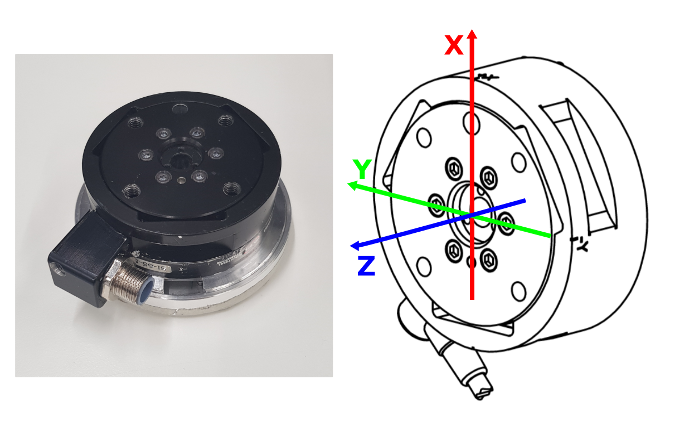

# net-ft-ros
Repository containing ROS packages and manuals for ATI 6-axis force torque sensors.

## Quick Start
- [Gamma model](#gamma-model)
- [Nano model](#nano-model)
- [Hardware setup](#hardware-setup)
- [Software setup](#software-setup)

## ATI 6-axis force torque sensors
The ATI 6-axis force torque sensors measure all six components of force and torque with respect to a sensing reference frame. 
There are two different sensors available at the lab:

#### Gamma model
The Gamma model has extremely-high strength with low weight and has a high signal-to-noise ratio. For more information 
and technical drawings, refer to https://www.ati-ia.com/products/ft/ft_models.aspx?id=Gamma. The sensing reference frame 
is indicated on the sensor itself and visualized in the picture below. The origin of the reference frame is located 
at the centre of the sensor flange (i.e. the flange surface is part of the xy-plane).



#### Nano model
TODO

## Hardware setup 
To work with the force torque sensor, the following things are required:
1. ATI Net Box
2. Power supply cable for the ATI Net Box
3. Ethernet adapter for the ATI Net Box
4. 4-pin transducer cable to connect the sensor to the ATI Net Box
5. Force torque sensor
6. Mounting flange plate
7. Mounting ring
8. Additionally, a RJ45 ethernet cable is required to connect the ATI Net Box to the local network.


Note that the mounting flange plate has two pins on the sensor side, whereas the sensor has two matching slots on the robot side:


#### Mount the sensor on the robot
To mount the sensor on the robot:
1. Insert the mounting flange plate into the mounting ring.
2. Screw the mounting plate onto the robot end-effector flange (which screws). Ideally, the sensing 
reference frame of the sensor is aligned with the robot end-effector frame. To that end, the mounting flange plates 
are not fully symmetric but they have some sort of cavity or indication. In this case, this is a line and it indicates 
the direction of negative **x** (because the sensor has a cavity in the direction of negative **x**). Therefore, align the indication 
on the mounting flange ring with direction of negative **x** of the robot end-effector flange (reminder on the end-effector
frame LINK HERE).
3. Put the sensor onto the mounting flange plate such that the pins enter into the slots and the 
indication on the mounting flange plate can be seen at the middle of the cavity of the sensor.
4. Connect the transducer cable to the sensor.


#### Set up ATI Net Box
Connect the other side of the transducer cable to the ATI Net Box and connect the API Net Box to the power supply.
Finally, connect the ATI Net Box to the local network with the ethernet cable. **ATTENTION:** the ethernet cable has to be
plugged to the port with number *D416.24* in the robot room. 

Once the ATI box is connected to the network, check the network connection. From your PC try to ping the ATI Net Box:
```
ping 128.178.145.89
```
If you can ping the ATI Net Box, then you are ready to use the force torque sensor. You can also put the IP into your browser 
and - if the pinging was successful - you should be able to see a webpage which shows the status of the sensor. The status should be *Healthy*.
Do not get confused by the contents of this webpage, IT IS NOT CORRECT?!?!

#### Tool side and transformations TODO
- screws in ee: 4xM6x1.0 between 7 and 18mm outside mounting flange plate
- screws on top: 4xM6x1.0 5.6 deep
- ee transformation? PICTURE
- sensor itself is 28.6mm
- plate is variable


## Software setup
To test the node that publishes the measured force and torque data with default settings, clone this repository, build your workspace and use
```
roslaunch netft_rdt_driver ft_sensor.launch ip_address:=xxx
```
where you put the IP address of the ATI Net Box used as launch argument.


The force torque information will be published on the topic **/ft_sensor/netft_data**.
With the default settings, the message type is **geometry_msgs/WrenchStamped** and the frame in which the data is published,
is called **netft_sensor**. To inspect the topic, run
```
rostopic echo -c /ft_sensor/netft_data
```
The messages that are displayed should look like this:
```
header: 
  seq: 9377
  stamp: 
    secs: 1454162697
    nsecs: 667636236
  frame_id: 'netft_sensor'
wrench: 
  force: 
    x: -0.248077
    y: -1.12601
    z: -1.639932
  torque: 
    x: -0.106468
    y: -0.108128
    z: 0.22924
```
#### Launch settings
The *netft_rdt_driver* node can be configured with several parameters which are set via the launch file arguments:
- **ip_adresss**: This is the static IP address of ATI Net Box currently in use for the force torque sensor.
- **bias**: Boolean, if true, the bias of the force torque sensor is computed at the beginning and is then subtracted from the raw data.
Note that this is only valid when no tool EXPLAIN is mounted onto the sensor ?!?!?!
- **rate**: The publishing rate of the node (in Hz).
- **frame_id**: The name of the frame in which the wrench data is published in.
- **alpha**: exponential filter value, number between 0 and 1. ?!?!?!
- **rot**: This variable performs a rotation around the NEGATIVE z-axis of the force and torque vectors. On the FT sensor there is a little dent which is a reference point which should be aligned with your world frame of reference. If it is not, because of how it is fixed to the robot, the rot variable allows you to make the necessary rotational correction. ??????
- **scale_x**, **scale_y**, **scale_z**: Values by which the data is multiplied, typically 1 or -1.
- **rqt_multiplot_bringup**: Boolean, if true, *rqt_multiplot* will be run to visualize the wrench measurements.

The [launch](netft_rdt_driver/launch) directory also contains an example of a [launch file](netft_rdt_driver/launch/ft_2_sensors.launch) 
that launches two *netft_rdt_driver* nodes, one per sensor. One sensor will then publish to **ft_sensor_left/netft_data** 
and the other one to **ft_sensor_right/netft_data**, where *ft_sensor_left* and *ft_sensor_right* are the names of these 
two nodes, respectively.

#### Bias computation through ROS service
The *netft_rdt_driver* node sets up a ROS service that can be called to compute and to print the bias of the force torque sensor,
e.g.
```
 rosservice call /ft_sensor/bias_cmd "cmd: 'bias'"
```
or 
```
 rosservice call /ft_sensor/bias_cmd "cmd: 'print'"
```
To call the service in C++ code make sure to include the service message type:
```
#include "netft_rdt_msgs/String_cmd.h"
...
ros::ServiceClient ft_client = nh.serviceClient<netft_rdt_driver::String_cmd>("/ft_sensor/bias_cmd");
netft_rdt_driver::String_cmd srv;
srv.request.cmd  = "bias";
srv.response.res = "";
f (ft_client.call(srv))
{
  ROS_INFO_STREAM("net_ft res: " << srv.response.res);
}else{
  ROS_ERROR("Failed to call netft bias service");
}
```

#### RQT Multiplot
The wrench measurements from the force torque sensor can be visualized in rqt_multiplot. If you don't have [rqt_multiplot](https://github.com/ANYbotics/rqt_multiplot_plugin) 
installed yet, run
```
sudo apt-get update
sudo apt-get ros-ROSVERSION-rqt-multiplot
rqt_multiplot --force-discover
```
(replace `ROSVERISON` with your version of ROS). Then
```
rqt_multiplot --multiplot-config ~/PATH_TO_YOUR_WS/src/net-ft-ros/netft_rdt_driver/config/force_torque_readings.xml
```
(replace `PATH_TO_YOUR_WS` with your catkin workspace). Alternatively, set the launch argument *rqt_multiplot_bringup* to true 
to launch rqt_multiplot together with your *netft_rdt_driver* node. 

Side note: A rqt_multiplot configuration file for two sensors at the same time is not provided, but 
can be easily created and added to this repository via pull-request.

#### RViz
You can add a [**Wrench**](http://wiki.ros.org/rviz/DisplayTypes/Wrench) message type in RViz. Make sure
it is subscribing to the correct ROS topic (usually **/ft_sensor/netft_data**) and that RViz knows the transform from any existing 
frame to the sensor frame set with the parameter **frame_id**. If this is not the case, publish such a transform to the **/tf_static** topic from the terminal.
